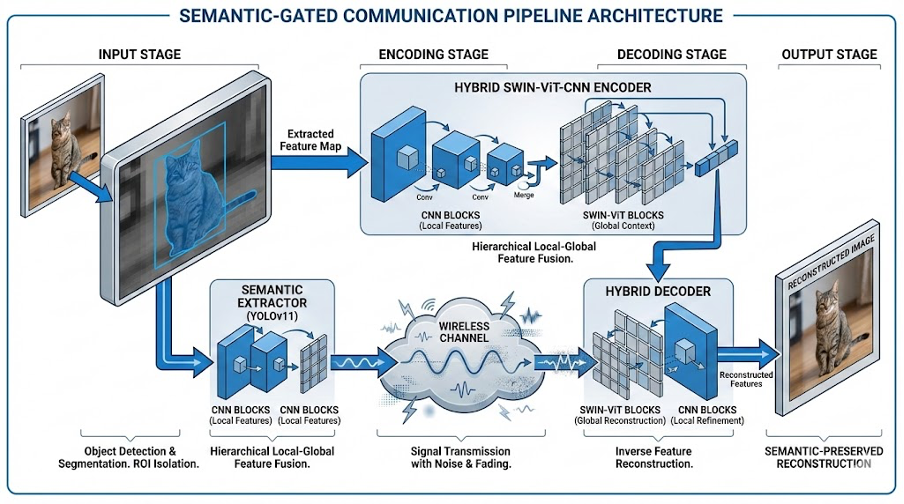
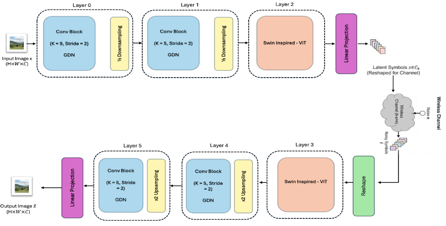
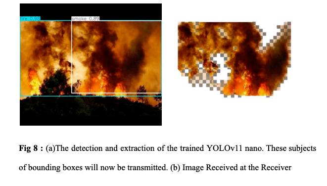

# Semantic Communications with Vision Transformer - User Guide

This repository implements a Deep Joint Source-Channel Coding (JSCC) system using Vision Transformers (SemViT) for semantic communications. It supports various channel models (AWGN, Rayleigh, Satellite, etc.) and hardware implementation via USRP.


<p align="center">
  
</p>

<p align="center">
  
</p>


## 1. Repository Structure

### Directories

- **`models/`**: Contains the core deep learning model definitions.
  - `model.py`: Defines the `SemViT` class, the main Autoencoder architecture (Encoder -> Channel -> Decoder).
  - `vitblock.py`: Implementation of the Vision Transformer blocks.
  - `channellayer.py`: Differentiable channel layers (AWGN, Rayleigh, Satellite, etc.) used during training.
  - `metrics.py`: Custom metrics like PSNR and SSIM.
- **`vision_sim/`**: Scripts for simulating visual transmissions.
  - `channel_sim.py`: Standalone script to simulate channel effects (AWGN) on binary IQ files (`iq_tx.bin` → `iq_rx.bin`).
  - `tx_vision.py` / `rx_vision.py`: Scripts likely used for transmitting and receiving vision data in a simulation loop.
- **`usrp/`**: Drivers and interfacing code for Universal Software Radio Peripheral (USRP) hardware.
  - `usrp_driver.py`: The main driver script that bridges a TCP client (simulation) to the physical USRP hardware using the `uhd` library.
  - `client.py`, `server.py`: Networking utilities for the hardware setup.
- **`utils/`**: Helper functions.
  - `datasets.py`: Data loaders for CIFAR-10.
  - `networking.py`: TCP communication helpers.
  - `qam_modem_tf.py`: QAM modulation/demodulation utilities (if used).
- **`analysis/`**: Scripts for analyzing trained model performance (PSNR, SSIM, Latent Structure, etc.).
- **`config/`**: Configuration files (e.g., `train_config.py`, `usrp_config.py`).
- **`weights/`**: Directory where trained model weights are saved.

### Key Files

- **`train_dist.py`**: The main entry point for training the model.
- **`download_cifar10.py`**: Utility script to download and organize the CIFAR-10 dataset.
- **`run_colab_experiments.bash`**: Example shell script for running multiple experiments sequentially.

---

## 2. Installation & Setup

### Prerequisites

- **Python**: Version 3.8 or higher is recommended (tested with Python 3.10).
- **CUDA/cuDNN**: If you plan to train on GPU, ensure you have the appropriate CUDA and cuDNN versions compatible with TensorFlow 2.11.

### Setting up a Virtual Environment

It is highly recommended to use a virtual environment to manage dependencies and avoid conflicts.

#### Option A: Using `venv` (Standard Python)

1.  **Create the environment**:
    ```bash
    python3 -m venv venv
    ```
2.  **Activate the environment**:
    - On macOS/Linux:
      ```bash
      source venv/bin/activate
      ```
    - On Windows:
      ```bash
      .\venv\Scripts\activate
      ```

#### Option B: Using `conda` (Anaconda/Miniconda)

1.  **Create the environment**:
    ```bash
    conda create -n semantic-comms python=3.10
    ```
2.  **Activate the environment**:
    ```bash
    conda activate semantic-comms
    ```

### Installing Dependencies

Once your environment is active, install the required packages using `pip`:

```bash
pip install -r requirements.txt
```

**Key Dependencies Installed:**

- `tensorflow==2.11.0` (Core ML framework)
- `tensorflow-compression==2.11.0` (For entropy coding/GDN layers)
- `sionna==0.14.0` (Library for 5G/6G channel modeling)
- `keras-cv`, `matplotlib`, `numpy`, `tqdm`, etc.

### Special Note for USRP Hardware

If you intend to use the USRP hardware (scripts in `usrp/`), you must have the **UHD (USRP Hardware Driver)** installed on your system. This is a system-level dependency, not just a Python package.

- **Ubuntu/Debian**: `sudo apt-get install libuhd-dev uhd-host`
- **macOS**: `brew install uhd`
- **Python Bindings**: After installing the system library, ensure the Python `uhd` module is accessible. Often this is installed via `conda install -c conda-forge uhd` or built from source.

## 3. Model Architecture (SemViT)

The model is a Semantic Video/Image Transformer (SemViT) designed for JSCC. It behaves as an Autoencoder:

1.  **Encoder**: Compresses the input image (512x512x3) into a sequence of complex symbols (IQ samples). It uses a mix of Convolutional blocks (`C`) and Vision Transformer blocks (`V`) as defined by the user. The ViT blocks have been enhanced with a **Shifted Window mechanism** (inspired by Swin Transformer) for improved efficiency and modeling of long-range dependencies.
2.  **Channel**: A differentiable layer that simulates physical channel distortions:
    - **AWGN**: Additive White Gaussian Noise.
    - **Rayleigh**: Fading channel.
    - **Satellite/GEO/LEO**: Specialized channels for satellite communications.
3.  **Decoder**: Receives the noisy symbols and reconstructs the original image.

**Key Architecture Updates:**

- **Shifted Window Mechanism**: ViT blocks now utilize shifted window attention to calculate self-attention within local windows, providing cross-window connections and reducing computational complexity for high-resolution images like 512x512.
- **Support for High-Resolution Inputs**: The model is optimized for 512x512 input dimensions, providing significantly higher reconstruction detail than standard CIFAR-scale models.

**Key Parameters:**

- `block_types`: A string of 6 characters defining the layers (e.g., `CCVVCC` = 2 Conv, 2 ViT, 2 Conv).
- `snrdB`: Signal-to-Noise Ratio in dB used during training.
- `data_size`: Total number of complex symbols sent (bandwidth).

---

## 3. Data Structure

The project is currently configured for **512x512 high-resolution images**.

### Recommended Data Setup

While the repository includes scripts for CIFAR-10, it is recommended to use high-resolution datasets (e.g., DIV2K, CLIC, or custom datasets) to leverage the model's 512x512 input support.

To use custom images, organize them into a directory structure:

```text
dataset/
└── custom_data/
    ├── train/
    │   ├── class_a/
    │   └── ...
    └── test/
        ├── class_a/
        └── ...
```

### Note on `train_dist.py`

The training script defaults to searching for images in `/dataset/CIFAR10/`. When using 512x512 resolution, ensure your data directory contains appropriately sized images. The `utils/datasets.py` script will automatically resize images to 512x512 if they differ.

**Recommendation**: Update the path in `train_dist.py` or create a symlink to your high-resolution dataset.

---

## 5. Jupyter Notebooks & Analysis

The repository includes several Jupyter notebooks for evaluating the models and comparing them against traditional digital baselines.

### Evaluation & Comparison

- **`colab_comparison.ipynb`**: Recommended for Google Colab users. It automates the process of loading trained weights and plotting their performance (PSNR/SSIM) against pre-calculated BPG baselines.
- **`compare_models.ipynb`**: Used to compare the robustness of different model variations (Mixed, LEO-specific, GEO-specific, AWGN) when tested on a specific difficult channel like **LEO**.
- **`full_comparison.ipynb`**: A rigorous benchmarking tool that compares Neural SemViT performance against the traditional digital baseline (BPG+LDPC) under matched bandwidth constraints on an AWGN channel.

### Visualization & Baselines

- **`visual_gallery.ipynb`**: Demonstrates the "Graceful Degradation" property of semantic communications. It provides a side-by-side visual comparison of:
  1.  **Original Image**
  2.  **Digital Reconstruction (JPEG)**: Shows the "Digital Cliff" effect (complete failure at low SNR).
  3.  **SemViT Reconstruction**: Shows how the image remains intelligible even as noise increases.
- **`bpg-ldpc.ipynb`**: Houses the simulation logic for the traditional digital baseline using BPG source coding and LDPC channel coding. This notebook was used to generate the benchmark data for the comparison notebooks.
- **`generalization_matrix.ipynb`**: Analyzes how a model trained on one type of channel (e.g., AWGN) generalizes when tested on another (e.g., Rayleigh or Satellite).

### Analysis Tools

- **`visual_comparison_grid.ipynb`**: Generates high-resolution grids of original vs. reconstructed images for publication and report quality visualization.

---

## 6. How to Run the Model

### Training

To train the model, use `train_dist.py`.

**Usage:**

```bash
python train_dist.py [data_size] [channel_type] [snr] [block_types] [experiment_name] [epochs] --filters [list] --repetitions [list]
```

**Example (from `run_colab_experiments.bash`):**
Training a model with `CCVVCC` structure, 512 symbols, 10dB SNR, on a Satellite channel:

```bash
python train_dist.py 512 Satellite 10 CCVVCC "experiment_name" 130 \
    --filters 256 256 256 256 256 256 \
    --repetitions 1 1 3 3 1 1
```

### Hardware Simulation (USRP)

To run with USRP hardware (requires `uhd` installed):

1.  **Driver**: Start the USRP driver script to initialize the hardware and listen for data.
    ```bash
    python usrp/usrp_driver.py
    ```
2.  **Client**: Run your transmission/inference script (e.g., customized `main.py` or client script) that connects to the driver via TCP to send/receive IQ samples.

### Pure Simulation

To test the channel simulation without training:

1.  Generate/Provide an IQ file `vision_sim/iq_tx.bin`.
2.  Run the simulator:
    ```bash
    python vision_sim/channel_sim.py --snr 10.0
    ```
3.  The output will be saved to `vision_sim/iq_rx.bin`.

---

## 7. Results and Analysis

### Dataset and Experimental Setup

The proposed models are trained on an A100 GPU using the TensorFlow framework and a custom dataset for training the YOLO model. This enables the model to perform highly accurate object detection (specifically identifying subjects, fire, and smoke) across varying environments.

For the semantic communication framework, we primarily trained our models on the **DIV2K** dataset, which consists of images with varying resolutions from 720p to 1440p. We then tested our models using the **Kodak PhotoCD** dataset.

Our architecture is adapted for different channel conditions, resulting in four specialized models:
- **AWGN-trained model**
- **Low Earth Orbit (LEO) trained model**
- **Geostationary Orbit (GEO) trained model**
- **Generalist model**: Combines the robust properties of both LEO and GEO models. 

Our evaluations indicate that the **Generalist model** is the best-performing approach. We have also compared this model with state-of-the-art (SOTA) models in semantic communication, as well as conventional image compression techniques such as **Better Portable Graphics (BPG)**. BPG's primary goal is to exceed standard JPEG efficiency, yielding smaller payloads with significantly higher visual quality. In our testing architecture, BPG acts as the source encoder while **Low-Density Parity-Check (LDPC) codes** function as the channel encoder, effectively protecting the compressed image data from transmission corruption. The models were trained under fixed channel state constraints (SNR = 10 dB) using the Adam Optimizer (learning rate: $1 \times 10^{-4}$, batch size: 16 for DIV2K).

### Analysis

This section presents a rigorous analysis of the semantic extractor (**YOLOv11n**) to validate the trained model's effectiveness and accuracy. The evaluation includes performance benchmarking on unseen data, a comprehensive review of training and performance metrics, and a detailed examination of the model's spatial attention mechanisms using feature map visualization.

#### Training Stability and Loss Convergence

The training dynamics of the YOLOv11n model were monitored over 100 epochs to assess its learning stability and generalization capabilities. As illustrated below, training exhibits strong convergence across three critical loss components: Box Loss, Classification Loss (Cls), and Distribution Focal Loss (DFL).

<p align="center">
  
</p>

#### Object Detection Metrics

**Precision-Recall Analysis**  
The proposed Goal-Oriented Pipeline achieves a high Area Under the Curve (AUC). Crucially, the system maintains high precision even at higher recall rates (0.8 ~ 0.9). By staying well above 0.9 in precision during this plateau, the system minimizes bandwidth wastage from false positive transmissions. The semantic mechanism is trained to prioritize confident fire detections, ensuring a bandwidth-efficient pipeline that transmits fewer "false alarms".

<p align="center">
  
</p>

**F1-Score Tuning**  
The performance balance was calibrated using the F1-Score curve. Real-world validation demonstrates that an optimal confidence threshold is situated at 0.45 ~ 0.5. Values below 0.45 detect more faint smoke signals but introduce unacceptable noise (dropping precision and F1), while higher thresholds risk overlooking legitimate early-state fires (dropping recall). 

<p align="center">
  
</p>

#### Semantic Feature Activations

To validate the efficiency of the Semantic Gatekeeper, we analysed the spatial feature maps extracted from the deep layers of the YOLOv11 backbone. As illustrated below, the activations are highly sparse, with the majority of the feature space exhibiting near-zero values.

This sparsity validates the *Semantic Gating* core thesis: our framework actively suppresses irrelevant background information, reallocating transmission budgets strictly to task-relevant Regions of Interest (ROI) such as fires or physical subjects, rather than sending useless raw pixel data.

<p align="center">
  
</p>

*(a) Detection bounding boxes forming the Semantic ROI.*  
*(b) The final SemViT decoder reconstruction on the ground station side.*

<p align="center">
  
</p>

### JSCC Transmission Performance

To evaluate channel-mode transmission efficiency, we define the Bandwidth Ratio (R), which calculates the ratio of utilized channel bandwidth (channel uses) to the original image dimensions. A lower bandwidth ratio implies superior compression.

**Reconstruction vs Channel Noise (AWGN 0 dB)**  
When compared under harsh noise (0 dB AWGN—typical of long-distance LEO/GEO environments) against conventional baseline constraints (BPG+LDPC), the proposed Generalist model outperforms digital boundaries. While traditional BPG digital techniques suffer the 'digital cliff' effect (complete failure at low SNR or bandwidth), the proposed model maintains smooth continuous reconstruction stability, highlighting the benefits of Analog Joint Source-Channel Coding (JSCC).

<p align="center">
  
</p>

Additionally, the Mixed Generalist architecture was cross-tested under specific satellite constraints—LEO (Fast Rayleigh fading) and GEO (Slow Rician fading) channels. In contradiction to specialized 'domain-locked' theories, the **Mixed (LEO+GEO) architecture** achieved State-of-the-Art (SOTA) consistency, scoring top performance across changing links (e.g., LEO fading at 33.3 dB and GEO stable limits at 29.8 dB), outperforming previous approaches such as DeepJSCC across all parameters.

<p align="center">
  
</p>

---

## Conclusion

This research project successfully addresses the critical bottleneck of high-resolution image transmission over bandwidth-constrained and noisy space-to-ground links. By shifting the communication paradigm from traditional "bit-level accuracy" to "semantic fidelity," we developed a robust Deep Learning-based framework capable of maintaining mission-critical intelligence even in deep fading regimes where traditional protocols collapse. 

The integration of a YOLOv11 edge-intelligence module converts our network from a continuous stream format to an *Event-Triggered* architecture. By discarding non-relevant background frames at the satellite source, this Semantic Gating mechanism inherently reduces downlink data volume and overhead during active surveillance. 

This work lays the foundation for Cognitive Satellite Communication Networks. Future iterations will introduce Adaptive Semantic Coding, whereby a satellite dynamically adjusts compression symbol sizes and semantic routing based on automated real-time channel estimation metrics, embedding active edge-intelligence directly into the physical ISRO communication layer.
